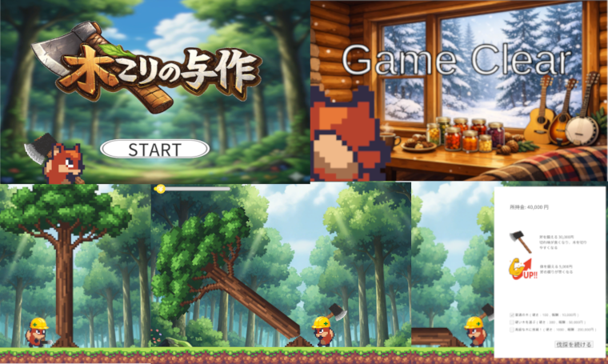

# 木こりの与作

## プログラムの場所
* Assets/Scriptsフォルダ：各スクリプト

## 作品の概要

### 作品について
本作は、木を左右から交互に切り出して伐採し、得られた報酬でプレイヤーを強化していく拡大再生産（資源管理）を軸としたアクションゲームです。
また、学んだ技術を自分の力で形にすることをテーマに、オープニングからエンディング（クリア判定）まで、ひとつのゲームサイクルとして完全に完結させています。

## 使用技術・ツール
* Unity (6000.3.5f2)
* VisualStudio community2026 C#
* 利用アセット SunnyLand Artwork(ビジュアル素材として利用)
* SourceTree / Git

## 制作期間（合計 11日間）
* 2026年2月22日～2026年3月2日（コアシステム構築）
* 2026年3月7日～2026年3月8日（演出強化・リファクタリング）

## 制作のポイント
### 外部ライブラリに頼らない自作スクリプトによる構築
学習した基礎知識をベースにしつつ、実現したい機能に合わせて自ら技術調査を行い、すべてのスクリプトをゼロから自作しました。  
* 木が倒れる動作を単なる回転ではなく、加速度（Acceleration）を加えた計算で実装しました。  
倒れる瞬間に CameraShake を連動させ、着地音（SE）と合わせて「重み」のあるフィードバックをプレイヤーに与えています。
* 木を「削る」感覚を出すために、Sprite Mask を算術的に制御する仕組みを独自に構築しました。  

### オープニングからエンディングまでのゲームサイクルの完結
演出の統合: 起動時のオープニング演出から、目標金額達成時のゲームクリア（エンディング）まで、一連の流れを一つの作品として完結させました。  
状態遷移の管理: GameManager と UIManager を連携させ、「プレイ中」「リザルト」「クリア」といったゲームの状態を正確に制御しています。

### 加速度を用いた倒木の演出
木が倒れる動作を単なる回転ではなく、加速度（Acceleration）を加えた計算で実装しました。  
倒れる瞬間に CameraShake を連動させ、着地音（SE）と合わせて「重み」のあるフィードバックをプレイヤーに与えています。

## 課題
* ゲームとしての楽しさは薄いものになってしまいました。落下物など、楽しめる仕組みそのものの実装が必要と考えています。
* パフォーマンスの最適化: 伐採時のエフェクト（パーティクル）などが増えた際の負荷対策を学び、実装に取り入れたいと考えています。  

## 所感
「学んだ技術を自分の手で形にする」ことを第一目標に掲げ、外部のテンプレートを使用せず全てのロジックを自力で組み上げました。
特に、木を倒す際の加速度計算や、Input Systemを用いた入力の切り替えなど、細かな仕様を一つずつ解決していく過程で、Unityにおけるゲーム開発の全体像を深く理解することができました。
ただプログラムを書くだけでなく、OPからEDまで「一つの作品として完成させる」経験を得られたことは、大きな自信に繋がりました。  
